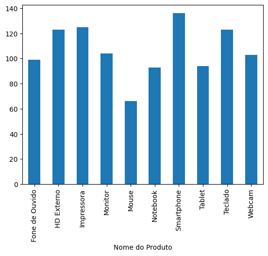

# Relatório da Primeira Semana

## 📊 Análise de Dados de Arquivo CSV

Nesta primeira semana, realizei uma atividade de análise de dados a partir de um arquivo CSV. O objetivo foi responder às seguintes perguntas:

### 🔍 Perguntas Investigadas

1. **Qual é o preço unitário médio dos produtos vendidos?**
2. **Qual foi o total de unidades vendidas?** (soma da coluna *Quantidade Vendida*)
3. **Qual foi o faturamento total por categoria?** (soma do *Total da Venda* agrupado por *Categoria*)
4. **Existe diferença significativa entre o faturamento médio por região?** Qual região vende mais e qual vende menos?
5. **Qual é o faturamento total de cada vendedor e a quantidade de peças vendidas?** Quem vendeu mais unidades?
6. **Crie um gráfico de barras** mostrando a quantidade total vendida por produto (agrupamento por *Nome do Produto* e soma da *Quantidade Vendida*).

### 📊 Resultados Obtidos

#### **1. Preço Unitário Médio**
**R$ 2.520,83**

#### **2. Total de Unidades Vendidas**
**1.066 unidades**

#### **3. Faturamento Total por Categoria**
| Categoria | Faturamento Total |
|-----------|------------------|
| 🎮 Acessórios | R$ 885.113,79 |
| 💻 Eletrônicos | R$ 897.948,47 |
| 🖱️ Periféricos | R$ 871.537,68 |

#### **4. Análise por Região**
| Região | Faturamento Médio |
|--------|------------------|
| 🏙️ Centro | R$ 29.994,95 |
| 🌅 Leste | R$ 29.747,14 |
| 🌲 Norte | R$ 29.122,24 |
| 🌇 Oeste | R$ 19.303,46 |
| 🌴 Sul | R$ 23.601,85 |

**🎯 Destaques:**
- **Maior faturamento:** Região Centro
- **Menor faturamento:** Região Oeste

#### **5. Desempenho por Vendedor**
| Vendedor | Quantidade Vendida | Faturamento Total |
|----------|-------------------|------------------|
| 👩‍💼 Ana | 101 | R$ 273.048,95 |
| 👨‍💼 Bruno | 149 | R$ 344.336,80 |
| 👩‍💼 Carla | 227 | R$ 657.747,07 |
| 👨‍💼 Diego | 58 | R$ 160.089,60 |
| 👩‍💼 Eduarda | 249 | R$ 422.427,98 |
| 👨‍💼 Felipe | 282 | R$ 796.949,54 |

**🎯 Destaques:**
- **Maior volume de vendas:** Felipe (282 unidades)
- **Menor volume de vendas:** Diego (58 unidades)

#### **6. Visualização**

### 🛠️ Ferramentas e Métodos

Utilizei as seguintes ferramentas para desenvolvimento e análise:
- **Jupyter Notebook** para execução e documentação do código
- **Pandas** para manipulação e análise dos dados
- **Matplotlib** para criação de visualizações e gráficos
- **ChatGPT** para auxílio na otimização do código e validação dos resultados

### 📈 Desenvolvimento

A combinação do Jupyter Notebook com as bibliotecas Pandas e Matplotlib facilitou significativamente:
- A compreensão e organização do código
- A manipulação eficiente dos dados
- A visualização clara das análises através de gráficos
- A interpretação dos resultados obtidos

### ✅ Conclusão

Todas as perguntas foram respondidas com sucesso, e os resultados foram organizados de forma clara e visualmente atraente.
